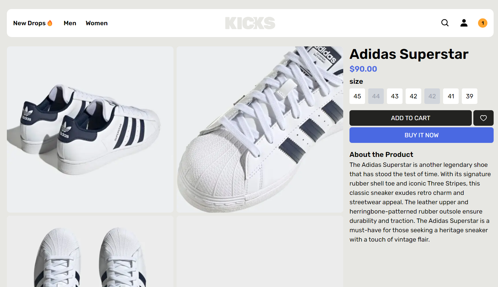

# [Kicks - A Modern Fullstack Webshop](https://kicks-webshop.vercel.app/)

Built with the Next.js App Router, TypeScript, Tailwind, Planetscale, Zustand and Prisma.

## Features

 - Authentication using NextAuth
 - Admin panel for adding products with image upload
 - Product Page
 - A beautiful and highly functional Search page.
 - Product cart and checkout system

## Tech Stack

- **Framework:** [Next.js](https://nextjs.org)
- **Styling:** [Tailwind CSS](https://tailwindcss.com)
- **Authentication:** [Next Auth](https://next-auth.js.org/)
- **ORM:** [Prisma Orm](https://www.prisma.io/)
- **File Uploads:** [Uploadthing](https://uploadthing.com)
- **Payments infrastructure:** [Stripe](https://stripe.com)

## Features to be implemented

- [ ] Checkout with **Stripe Checkout**
- [ ] Admin dashboard with stores, products, orders, subscriptions, and payments
- [ ] React Email
